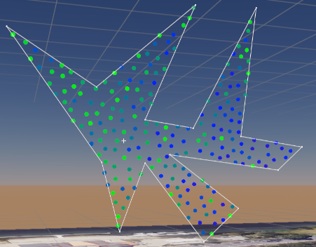

# AERO Studio - 2023.1

## Features

### New Track Event System

- Joins and tracks have been replaced with a new "Track-Only" event system
- The portion of an event that is dedicated to transitions can be defined via a new gizmo
- Transition easing curve is now displayed on the track event
  

### Automatic Overflow shapes

- Formation Elements and the launchpad can now be assigned a "Default Shape"
- When drones are unslotted, they will automatically be matched and assigned to the default shape
- This eliminates the need for overflow grids in formation groups

### Formation Sequences

- Adds a new scene object that contains its own track timeline.
- This object can be used to transition portions of a swarm independently
- Formation sequences contain their own formation preview identical to the launchpad preview

### New Preview System

- Preview discontinuities have been eliminated
- Preview now exists for return to home event
- The same preview system is used for the launchpad and formation elements

### Staggered Launch

- The staggered launch sequence is now fully supported. This new sequence launches drones one at a time while maximizing spacing. This sequence minimizes the impact of brief toilet-bowling during launch and is now the safest option.
    

### Staggered Transitions

- Transitions can now be staggered as a percentage of the event's total transition time
- Staggering can be ordered in many different ways such as left-to-right, front-to-back, closest-first, farthest-first, and more.

### New High-Performance Spline Rendering System

- Spline algorithms and rendering have been redesigned to be faster and more flexible
- Thousands of segments can now be displayed simultaneously without affecting performance

### Rebuilt UI list element

- Lists of items can be reorganized
- Headers now display a preview of each entry's contents

    

### New High-Performance Show Rendering System

- Up to 10x faster render times vs 2022.4 (In Preview)
- Reduced memory usage
-
    

### New Animation Editor

- Simplifies and expands upon the ability to animate scene objects' property, transform, and modifier values
- Select scene objects to add, remove, or modify all animatable layers, events, and properties
- Hierarchy

- 
  - Best suited for visualizing, adding, and removing animated elements
  - Displays all selected scene objects and their respective animatable elements
  - The "+" button is used to add the appropriate animatable element at any given level of the hierarchy (layers, events, properties)
  - Elements in the hierarchy can be deleted by right clicking on the element and selecting "Delete"
  - The eye icon is used to show/hide curves (graph editor only)
  - The lock icon prevents any changes from being made to an animatable element
- Dope Sheet
- 
  - Best suited for assigning key times across properties
  - Displays all property keyframes at their given time values
    - Keyframes trickle up the hierarchy so that any ancestor of a property will share a keyframe at the same time
    - Any properties that share the same time values can be modified together via a common ancestor
  - To add a new keyframe to a property right click on a property row and select "Add Keyframe"
  - Click and drag keyframes to move them along the timeline
  - To delete keyframes, select the keyframes, right click on the Dope Sheet, and select "Delete Keyframes"
  - Animation events are depicted as teal blocks in the background of the Dope Sheet
    - Modify the start time of an animation event by dragging it from the center
    - Drag the edges of the animation event to extend or reduce its duration
- Graph Editor
- 
  - Best suited for assigning key values and transition curves
  - Displays all property keyframes at their given times and values
  - Selecting a keyframe will display its handles
    - Modify a keyframe's handles to modify the transition curve between two keyframes
  - To add a new keyframe, select the property (either via the hierarchy or by selecting any of its existing keyframes), right click in the Graph Editor, and select "Add Keyframe"
  - To delete keyframes, select the keyframes, right click on the Graph Editor, and select "Delete Keyframes"
- In addition to the two views, keys can be added by directly manipulating scene objects at a given time

    
  - Auto Key Mode
    - To enable, click the Auto Key Toggle (left in the image above)
    - When enabled, any modifications to a scene object's animatable properties will automatically create new keys with the corresponding time and values
    - If the property is not already being animated, the appropriate layers, events, and properties will automatically be added
    - If the property is already being animated, then creating an auto keyframe outside of the bounds of an animatable event will NOT create a new keyframe
  - Add Key Button
    - "+" button in the image above
    - When pressed, adds a new key for all animated properties with the corresponding time and values

### Grid Snapping

- Located in the toolbar, the Grid Visualization button (left) and Grid Snapping button (right) can be used to easily align scene object positions

  
- Grid Increment can be customized at Edit > Settings > Designer > Options > Grid Snapping Increment
- Grid Increments automatically change to safety distance when editing geometry

### UI Improvements

- Adds transform toggle panel

    
- Added the ability to clear scene shape references
- Playhead line now extends all the way down the timeline window

### New modifiers

- Added many new geometry modifiers:
  - Globe (2D to Sphere) Modifier
  - Noise Modifier
  - Skew Modifier
  - Spherify Modifier
  - Taper Modifier
  - Twist Modifier

    

### Discrete Font Format (.asf)

- A new font format is supported that allows svg or point clouds to be used in the place of text
- This makes it possible to define your own fonts that use fixed or flexible drone counts
- Two files are now provided by default. One made of splines, another made of point clouds.

### Array Object

- Array objects make it easy to repeat a shape multiple times in space
- Objects can be copied linearly, around a circle, or across *any* shape
- Entire shapes obey the rules usually applied to individual slots

### Rebuilt Flocking Tools

- Flocking performance improvements
- New toolbar allows flocking to be previewed and modified in real-time to better understand how rules impact behaviors
- Adds simplex curl turbulence rule
  

### New Polygon2D Shape

- You can now define a 2D polygon which contains filled slots
- The polygon can be slotted by either filling it with a grid, or via random sampling
  

### New Geometry Modification Tools

- Splines, point clouds, and polygons can now be modified via new toolbar
- Vertices can be multi-selected via box select or Ctrl-click
- Rotate and scale gizmos can now be used to modify multiple points at once
- Multiple objects of the same type can be manipulated simultaneously
- Geometry anchor points can be automatically shifted to an object's center or at the center of multiple objects

### Scene Rendering

- You can now hide the map
- Drone light rendering has been improved and is now volumetric and reflects on surfaces
- Water can now be enabled to improve visualization of shows over bodies of water
  

### Edit Mode

- There is now as new visualization mode that hides all scene rendering to focus on geometry

### UI/UX Changes

- There have been extensive changes to naming conventions, available settings, and interactions to make things more clear and accessible

### Video Projection

- Video projection performance has been improved dramatically and can be used without fear of slowing down the design studio or renders

## Other Enhancements

- Import: Automatically resizes point clouds and animated point clouds to fit min spacing
- Launch: Launch events now join the first shape by default
- Launch: Launch events now default to stagger launch by default
- Launchpad: Arbitrary launchpad shapes now copy the previously selected formation to an editable point cloud. This enables a simpler way to set up arbitrary launchpads
- Render Settings: Spacing now defaults to 1m, down from the previous 1.5m
- Startup: Will now display an error message and force the user to close the application when trying to launch the studio while another instance is running
- SVG: Added support for Circles (Ellipses were previously the only option) in the SVG importer
- UI: The list interface will now save its collapse state and restore it when deselecting and selecting an object
- Video Recording: Audio capture is now supported
- Video Recording: Output file sizes have been reduced by nearly 80%
- Video Recording: New advanced export settings have been added

## Other Bug Fixes

- Lighting: Fixed issue where a light chase event would illuminate the end of the shape on the first cycle
- Scatter Field: Fixed issue where radius was not being serialized in scatter fields
- Timeline: Starting a render will now set the state of the object according to the earliest state of all interp events in its timeline
- Timeline: Fixed issue where multiple channels with animation events would not resolve correctly when scrubbing the timeline
- Timeline: Fixed issue where some events would not resolve the final frame of an interpolation (Ex. Transform events)
- Scene References: There are now checks to help to avoid self-referencing loops
- Timeline: Light layer order is now properly recognized when modified
- Timeline: Fixed issue where selecting certain events was not performing as expected and would leave previous events selected still
- And Many More...
