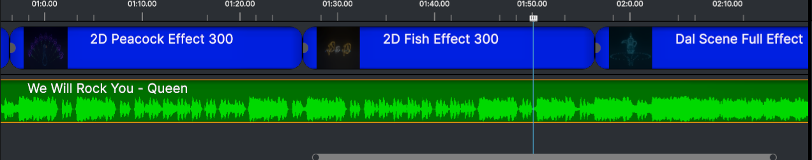
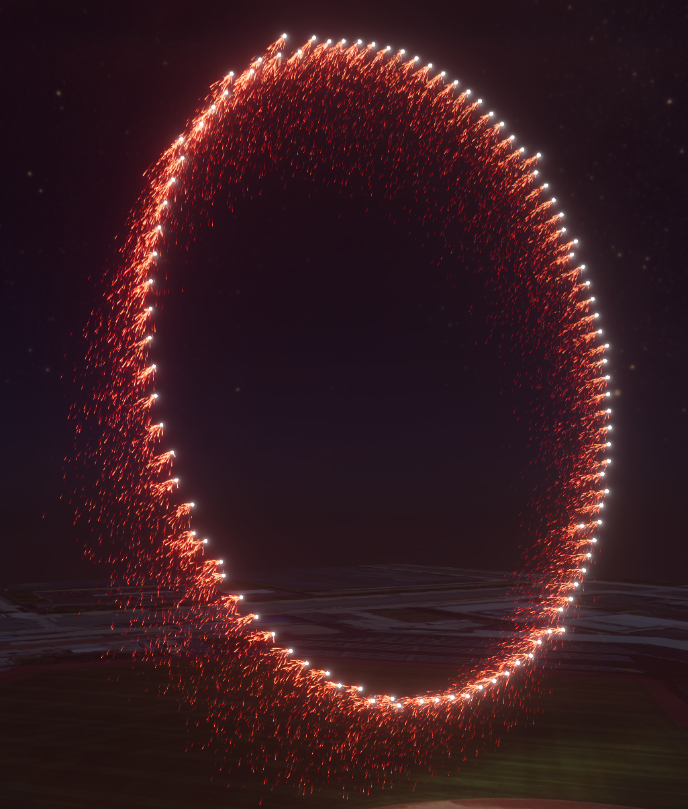
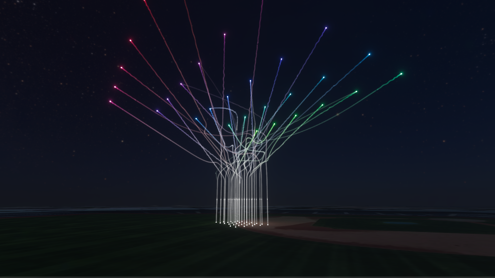
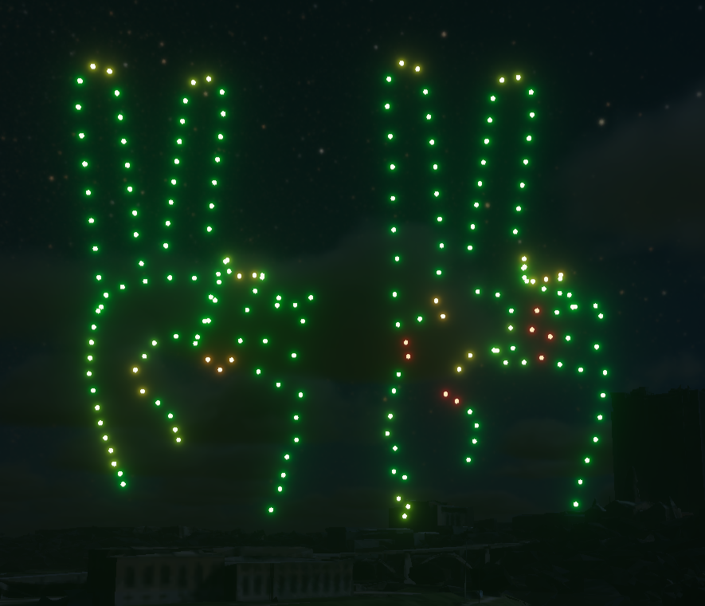

# AERO Studio - 2024.1.0.0

## Features

- New render sequence system
- New RTH checkpoint system allows shows to be safely diverted and returned with full path deconfliction at 30 second or 1 minute increments
- Added rendered sequence viewer to the agent list
  - Can plot useful data for individual sequences
  - Can view a scene preview for selected sequence
  - Can view flight and safety zone space for selected sequence
- Added Show Effects Engine
  - New way to package, design, and deploy drone show effects
  - Create a single effect that can support any combination of drone counts
  - Collapse complex shapes and events into a single object
  - Sequences can be played back in a single event making show modification much faster
  - Convert existing vfabs directly into a show effect with the click of a button
- Added a Scene Object Picker Interface
  - Automatically insert objects into selected scene nodes
- Added exporter plugins for Blender, Maya, and Cinema4D that can be installed from the Design Studio
- Added a "Polygon Ruler" with configurable units
- New Composer workflow
  - Simple drag and drop interface to quickly create shows with pre-existing effects
  - Open by clicking the  button
  - Comprised of one visual track and one audio track 
  - Supports Show Effects, standard vfabs, svgs, point cloud images, and audio clips
  - Basic modifications can be made to visual effects in the Composer Inspector
  - The show generated by the composer is contained within a 'Composer Output' scene object in the Design Studio
  - Unpack the 'Composer Output' to make advanced modifications
- Added cloud asset management system
  - Asset Browser now supports both local and cloud assets
  - Publish Show Effects as Digital Assets to share them with other members of your organization
  - Digital Assets can be drag and dropped into the Design Studio or Composer just the same as local assets
  - Create Asset Collections for your organization and add Digital Assets to any number of Collections
  - Share your Asset Collections with other organizations (private by default)
- Added pyro pre-viz system
  - Supports colorable waterfalls, comets, gerbs, and mines
  - Pyro directions can be resolved via the payload target system
  - Pyro can be triggered via the payload trigger system
  - Pyro is physically simulated and obeys gravity
  
- Pyro payload manifest export
  - Exports pyro triggers, timing, payload info, and direction to an excel spreadsheet
- Added ability to fix the yaw of the drone over the course of its flight
- Drone show previews can now be seen in render mode without needing to render the show
- Added new options to the scene view to enable/disable fog, change the sky to a solid color or gradient, and more
- Added ability to capture screenshots using render settings
- Added long exposure capture
  
- Added heatmap displays for previews and renders that can show issues with velocity, density, or render divergence
  
- Added staggered land
- Added a button to automatically scale any object to a desired drone density

## Enhancements

- Hierarchy Enhancements
  - Color-Coded Object Icons now appear in the hierarchy to improve visual parsing
  - Shift-click now performs a range select
  - Moving/nesting multiple scene nodes at once is now supported
  - Entries can be renamed by double-clicking on them
  - Right-click menu now has option to create/insert any scene object type
- Inspector now has a button to go to previously selected object and to go from an event to its linked object
- Scene speaker changes texture to show when it is muted
- Improved verbosity of render stages
- Replaced min quality drone renderer with high performance self-illuminating circles
- Compresses color stream data, resulting in significantly smaller uncompressed show file sizes
- Performance improvements for shows with many choreography events
- Performance improvements for rendering scene graphs
- Added ability to reverse direction of spline revolutions
- Added option to define certain lighting events with BPM rather than Hz
- Added camera lensing to scene views, enhancing render quality
- Added ability to toggle SSGI (Screen-Space Global Illumination)
- Added ability to tweak the ambient lighting multiplier
- Improved staggered launch speed for large drone fleets (> 750)
- Improved path modifier solver to use spline distance rather than normalized t for undistorted motion

## Bug Fixes

- Fixed issue where file references could not be resolved for fonts or for audio files
- Fixed issue where speaker texture always rendered regardless of its enabled state
- Fixed issue where speaker icon alpha was not being obeyed
- Fixed Text Shape bounds being calculated incorrectly
- Numerous fixes to cases where rendering is blocked due to missing file references
- Fixed bounds being incorrectly calculated for Fill Circles
- Fixed distortion occurring on path modifiers
